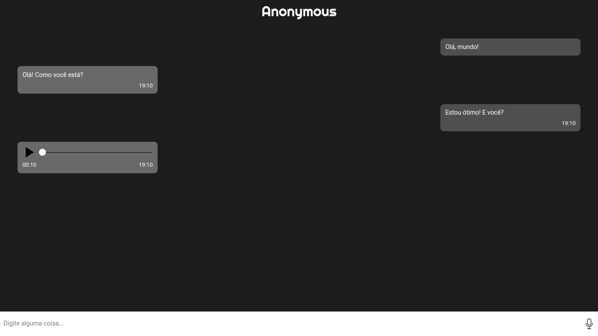

# Javascript Web Chat
💬  Anonymous chat made with Javascript 

This application uses websockets for sharing information like text messages. Furthermore, it is also possible to send audio messages to users. The entire application was made with pure Javascript

## App

